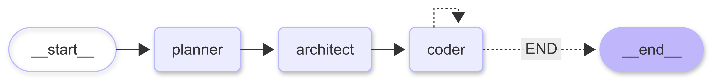

# Coder Buddy

Coder Buddy is a CLI-based AI coding assistant that turns a natural-language prompt into generated source code.
It uses a multi-step agent workflow to plan the project, break it into implementation tasks, and write files into a local output folder.

## What it does

- Takes a user prompt such as `Create a simple calculator web application`
- Builds a structured project plan
- Converts that plan into file-level coding tasks
- Writes generated files into `coder-buddy/generated_project/`

## How it works

The system follows a simple 3-step pipeline:

1. **Planner**  
   Turns the prompt into a structured project plan.

2. **Architect**  
   Breaks the plan into ordered implementation steps.

3. **Coder**  
   Uses file tools to create or update project files.

## Architecture



Core runtime files:
- [coder-buddy/main.py](coder-buddy/main.py) - CLI entrypoint
- [coder-buddy/agent/graph.py](coder-buddy/agent/graph.py) - LangGraph workflow
- [coder-buddy/agent/prompts.py](coder-buddy/agent/prompts.py) - prompt templates
- [coder-buddy/agent/states.py](coder-buddy/agent/states.py) - Pydantic schemas
- [coder-buddy/agent/tools.py](coder-buddy/agent/tools.py) - file read/write tools

## Results

Bundled sample outputs:
- [coder-buddy/pre_generated_project_calculator/index.html](coder-buddy/pre_generated_project_calculator/index.html)
- [coder-buddy/pre_generated_project_todo_app/index.html](coder-buddy/pre_generated_project_todo_app/index.html)

Runtime output folder:

```text
coder-buddy/generated_project/
```

## Demo

Add your screenshots here:

```md


```

## Setup

1. Add a `.env` file inside `coder-buddy/`

```env
GROQ_API_KEY=your_groq_api_key_here
```

2. Install dependencies

```bash
cd coder-buddy
pip install groq "langchain>=0.3.27,<0.4" "langchain-core>=0.3.72,<0.4" "langchain-groq>=0.3.7,<0.4" "langgraph>=0.6.3,<0.7" "pydantic>=2.11.7" "python-dotenv>=1.1.1"
```

3. Run the CLI

```bash
python main.py
```


